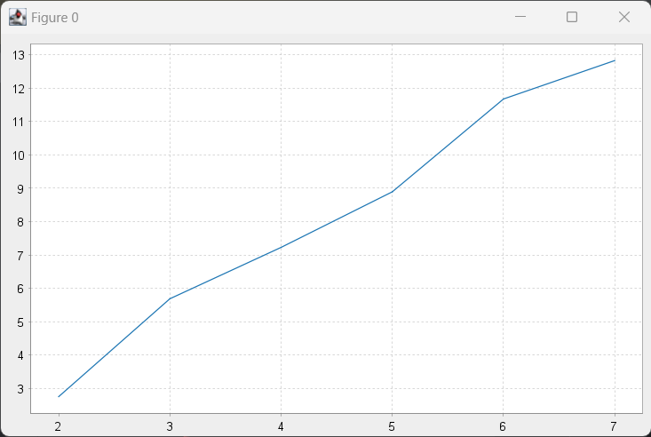

# Stochastic Analysis

## Task 3: Large Scale Design

The system behaviour is described by the following set of rules:

```
val rules = DAP[Place](
    Rule(MSet(S, M1), m => 1, MSet(S, R1), MSet(R1, T), MSet(M1)), // start the communication
    Rule(MSet(M1), m => 1, MSet(R1), MSet(R1, T, S), MSet(M1)), // forward message M1
    Rule(MSet(T, M1), m => 1, MSet(T, R1), MSet(R1), MSet(M2)), // M1 message arrived at destination, forward M2 message
    Rule(MSet(M2), m => 1, MSet(R2), MSet(R2, T, S), MSet(M2)), // forward message M2
    Rule(MSet(M2, S), m => 1, MSet(S, R2), MSet(R2), MSet()), // forward message M2
    
    Rule(MSet(M1, M1), m => 100000, MSet(M1), MSet(), MSet()), // destroy messages in surplus
    Rule(MSet(M2, M2), m => 100000, MSet(M2), MSet(), MSet()), // destroy messages in surplus
)
```

- The places S and T represents respectively the source and the target of the communication; 
- M1 represents the message that S wants to send to T, while M2 is the T's reply;
- R1 and R2 places are used to indicate that the respective message (M1 or M2) has already been elaborated by the 
given node.

The places R1 and R2 are essential for a correct working. Without them, every node would forever exchange the same message
with its neighbours:
- A consumes the message M1 sending it to all its neighbours. By consuming the token in the place M1, the transition of
the node A is not firable anymore, however...
- ... when B (neighbour of A) consumes the token M1, send the message to all its neighbours, including also A, therefore the 
transition of A that was not firable before, becomes firable again
- this process continues forever until finally the source node receive the message M2

By introducing the places R1 and R2, A can send the message to its neighbours only if it hasn't done it yet. This avoid
the infinite loop and made the communication from S to T very much faster. Without the R1 and R2 places expedient, 
the simulation of the system is much slower because the number of firable transition at each step is way higher.

Given a network of k*k devices connected in a square-like network, the average simulation time is depicted 
by the following graph:  



The x-axis represents the width of the square (k), while the y-axis represents the simulation time in unit of times.